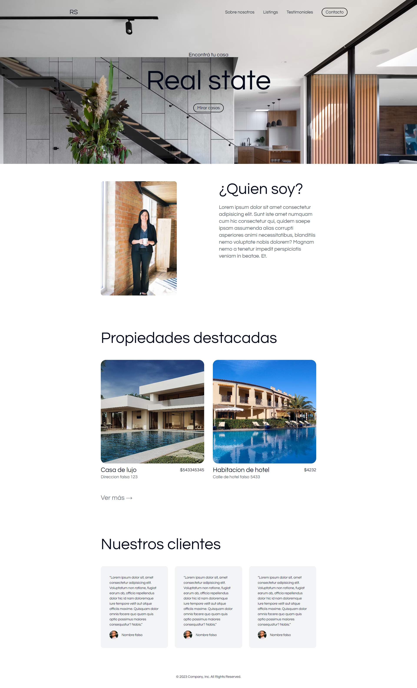
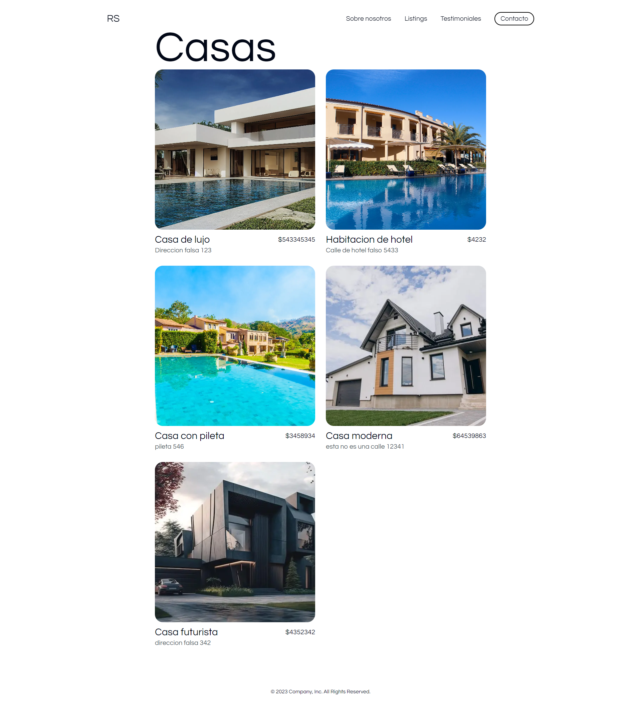
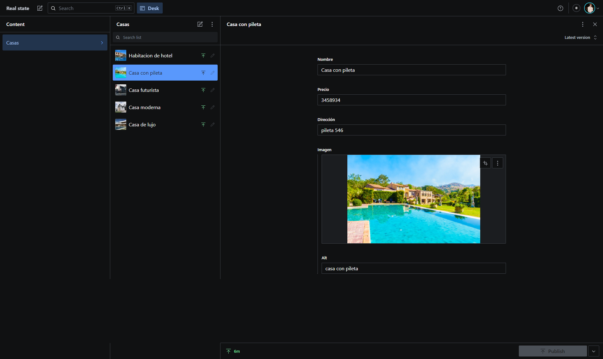

# Landing page - Real state

## Sobre la aplicación

Hice este proyecto para ver como funciona sanity

[Sitio web](https://realstate-sanity.vercel.app/)
[Repositorio](https://github.com/FedericoLuna01/realstate-sanity)

## Vista previa







<a name="readme-top"></a>

### Construida con

- [![React][React.js]][React-url]
- [![Typescript][Typescript]][Typescript-url]
- [![Tailwind][Tailwind]][Tailwind-url]
- [![Next][Next]][Next-url]
- [![Sanity][Sanity]][Sanity-url]

## Getting Started

Para tener una copia local de esta aplicación seguí los siguientes pasos.

### Requisitos previos

Instalar la ultima versión de NodeJS.

- npm
  ```sh
  npm install npm@latest -g
  ```

### Instalación

1. Clonar el repositorio.
   ```sh
   git clone https://github.com/FedericoLuna01/realstate-sanity.git
   ```
2. Instalar los paquetes de NPM.
   ```sh
   npm install
   ```

### Iniciar aplicación

```sh
npm run dev
```

<p align="right">(<a href="#readme-top">volver arriba</a>)</p>

<!-- CONTACT -->

## Contacto

Federico Luna - [LinkdedIn](https://www.linkedin.com/in/federico-luna-dev/) - [Sitio Web](https://federicoluna.netlify.app) - federicolun4@gmail.com

<p align="right">(<a href="#readme-top">volver arriba</a>)</p>

<!-- MARKDOWN LINKS & IMAGES -->

[React.js]: https://img.shields.io/badge/React-20232A?style=for-the-badge&logo=react&logoColor=61DAFB
[React-url]: https://reactjs.org/
[Typescript]: https://img.shields.io/badge/typescript-20232A?style=for-the-badge&logo=typescript&logoColor=61DAFB
[Typescript-url]: https://www.typescriptlang.org/
[Tailwind]: https://img.shields.io/badge/tailwindcss-20232A?style=for-the-badge&logo=tailwindcss&logoColor=61DAFB
[Tailwind-url]: https://tailwindcss.com/
[Next]: https://img.shields.io/badge/next-20232A?style=for-the-badge&logo=nextdotjs&logoColor=000000
[Next-url]: https://nextjs.org/
[Sanity]: https://img.shields.io/badge/sanity-20232A?style=for-the-badge&logo=sanity&logoColor=#F03E2F
[Sanity-url]: https://www.sanity.io/
